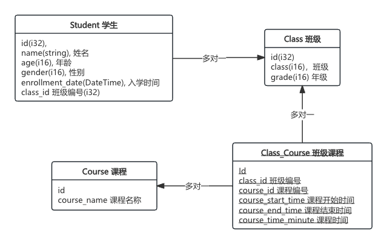

# sea-orm 测试Demo

[TOC]

## 表关系图



## demo使用方式

1. demo中使用postgres数据库

2. 使用了 `migration` 生成表与初始化的数据，在通过 `sea-orm-cli` 将表定义转成 `entity`

   `script/make_entity_by_migration` 脚本用于自动生成entity中的表定义

   ` script/create_table_by_migration ` 脚本用于自动生成表与表中的数据

### 生成新的 migration 创建表文件

```bash
sea-orm-cli migrate generate <文件名>
```


